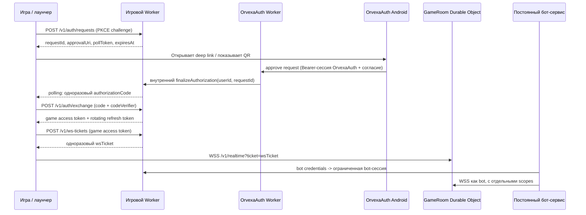

# Интеграция OrvexaAuth с игровой экосистемой

**Статус:** техническая инструкция для реализации другим ИИ-агентом  
**Автор:** Manus AI  
**Дата:** 19 августа 2026 г.  
**Цель:** подключить OrvexaAuth как единый сервис идентификации к отдельной игре в жанре survival/PvP, похожей по структуре на Rust, не смешивая игровой backend с OrvexaAuth и не передавая пароль или долгоживущий токен OrvexaAuth игровому серверу.

> **Главное архитектурное правило.** OrvexaAuth Worker отвечает только за личность пользователя и её подтверждение. Отдельный игровой Worker отвечает только за игру: игровой профиль, мир, инвентарь, матч, сессии, WebSocket и права на игровые действия. Постоянные боты работают отдельным процессом на хостинге, а не внутри Worker.

## 1. Что уже есть и что требуется добавить

Текущий OrvexaAuth Worker доступен по адресу `https://orvexaauth-api.bot724524.workers.dev`. В исходнике есть обычный вход по e-mail и `passwordHash`, сессии Bearer и QR-поток. Сессия создаётся на 30 дней и хранит `userId`, `email`, время выдачи/истечения и метаданные устройства. Защищённые обычные маршруты принимают заголовок `Authorization: Bearer <sessionToken>`.[1]

| Возможность | Текущее состояние | Использование для игры |
|---|---|---|
| Регистрация | `POST /api/register` | Не нужна в игровом Worker; выполняется в OrvexaAuth-клиенте или на сайте OrvexaAuth. |
| Вход по паролю | `POST /api/login` | Уже работает, но **не должен** быть формой входа внутри игры в production. Игра не должна получать пароль пользователя. |
| Сессия пользователя | Случайный `sessionToken`, 30 дней | Используется только приложением OrvexaAuth для подтверждения согласия пользователя. Не передавать в игровой Worker. |
| QR-запрос | `POST /api/qr/sessions`, получение статуса `GET /api/qr/sessions/:id` | Подходит как прототип UX, но текущий polling после одобрения возвращает `sessionToken`; поэтому для production его нельзя напрямую подключать к игре. |
| Игровая авторизация с согласием | Отсутствует | Нужно добавить отдельный протокол `game-auth`, описанный ниже. |
| Проверка Orvexa-сессии межсервисно | Отсутствует в безопасном виде | Нужно добавить внутренний интерфейс через Service Binding либо подписанный HTTPS-callback. |

### 1.1. Существующие HTTP-контракты OrvexaAuth

Следующие запросы отражают **реальный текущий API**, а не новый игровой контракт. Пространство данных выбирается заголовком `X-Database-Name`; если его нет, Worker использует `default`.[1]

| Метод и URL | Тело / заголовки | Результат | Важное ограничение |
|---|---|---|---|
| `POST /api/register` | JSON: `email`, `passwordHash`, опциональные профильные поля | `201`, профиль, `sessionToken`, `expiresAt` | Логика вычисления `passwordHash` должна совпадать с приложением OrvexaAuth. Игре этот пароль не нужен. |
| `POST /api/login` | JSON: `email`, `passwordHash`, опционально `totpCode`, метаданные устройства | `200`, профиль, `sessionToken`, `expiresAt` | Не встраивать парольную форму OrvexaAuth в игру. |
| `POST /api/sessions` | Те же учётные данные | `201`, `token`, `sessionToken`, `user`, `expiresAt` | Также выдаёт долгоживущую сессию OrvexaAuth. |
| `GET /api/sessions/:token` | Токен находится в пути URL | `200` с данными сессии или `401` | Не использовать для production-проверки из игрового Worker: секрет попадает в путь запроса и маршрут сейчас публичен. |
| `POST /api/qr/sessions` | JSON: `deviceName`, `deviceType`, `appName` | Короткоживущий `requestId`, deep link, 5 минут | Можно сохранить UI-идею QR, но не выдавать через него Orvexa `sessionToken` игровому клиенту. |
| `POST /api/qr/sessions/:id/approve` | Bearer-сессия OrvexaAuth | Одобряет запрос | Имеющийся Android-клиент может служить ориентиром для нового экрана согласия. |

#### Пример текущего входа — только для проверки OrvexaAuth, не для игрового клиента

```bash
curl -X POST 'https://orvexaauth-api.bot724524.workers.dev/api/login' \
  -H 'Content-Type: application/json' \
  -H 'X-Database-Name: default' \
  -H 'X-App-Name: OrvexaAuth' \
  --data '{
    "email": "player@example.invalid",
    "passwordHash": "<хеш в том же формате, что у OrvexaAuth>"
  }'
```

**Не добавлять этот запрос в игру.** Он приведён только для изолированного тестирования нынешнего Worker. Передача `passwordHash` игре создаёт второй сервис, которому приходится доверять парольной производной пользователя, и делает смену логики хеширования сложнее и опаснее.

### 1.2. Обязательное исправление до подключения игры

На момент написания `checkServiceKey()` возвращает `true`, то есть обычные public beta-маршруты не требуют сервисного ключа.[1] Кроме того, токен в `GET /api/sessions/:token` передаётся в URL. Поэтому другой ИИ **не должен строить production-вход по схеме** «игра получает `sessionToken` и проверяет его через этот URL».

Нужно добавить новый, выделенный поток `game-auth`; старые маршруты не удалять, чтобы не сломать Android-приложение. Это не миграция учётных записей, а надстройка над уже существующей идентификацией.

## 2. Целевая архитектура



### 2.1. Границы доверия

| Компонент | Доверяет | Не получает и не хранит |
|---|---|---|
| OrvexaAuth Android / web-клиент | Только OrvexaAuth Worker | Игровой пароль, игровой refresh token, `ADMIN_SECRET`, bootstrap secret. |
| OrvexaAuth Worker | Собственному KV/DO и явно разрешённому Game Worker | Пароль в открытом виде, ключи ботов. |
| Игровой Worker | Подписанному callback или явной внутренней связи с OrvexaAuth | Пароль пользователя, `passwordHash`, долгоживущий `sessionToken` OrvexaAuth. |
| GameRoom Durable Object | Игровому Worker и игровому access token | Таблица учётных данных OrvexaAuth и административные секреты. |
| Бот-сервис | Игровому Worker с отдельной bot-идентичностью | Пароль или личная сессия игрока. |
| Игровой клиент | Игровому Worker и полученному игровому access token | Любые серверные секреты, callback key, приватные ключи подписи. |

## 3. Рекомендуемый протокол Game Authorization

Этот протокол похож по смыслу на OAuth Device Authorization + PKCE, но является внутренним контрактом Orvexa и не требует устанавливать внешний OAuth-сервер. Он исключает передачу Orvexa `sessionToken` игре.

### 3.1. Новые маршруты игрового Worker

| Метод и маршрут | Клиент | Назначение | Срок жизни |
|---|---|---|---|
| `POST /v1/auth/requests` | Игра / лаунчер | Создаёт запрос на вход и привязывает его к PKCE challenge. | 5 минут |
| `GET /v1/auth/requests/:id` | Игра / лаунчер | Возвращает только статус запроса; при одобрении выдаёт одноразовый code после проверки `X-Poll-Token`. | До завершения |
| `POST /v1/auth/exchange` | Игра / лаунчер | Меняет одноразовый code + `codeVerifier` на игровые токены. | code — одна попытка, access — 15 минут |
| `POST /v1/auth/refresh` | Игра / лаунчер | Ротирует refresh token и выдаёт новую пару токенов. | 30 дней, с ротацией |
| `POST /v1/auth/logout` | Игра / лаунчер | Отзывает игровую сессию и refresh token. | Немедленно |
| `POST /v1/ws-tickets` | Игра / лаунчер | Выдаёт однократный билет для WSS-подключения. | 30 секунд |
| `GET /v1/realtime?ticket=...` | Игра / бот | Переключает соединение на WebSocket после атомарного погашения билета. | Одна попытка |

Во всех ответах использовать общий envelope. Не возвращать e-mail, `sessionToken` OrvexaAuth или парольную производную.

```json
{
  "ok": true,
  "data": {},
  "requestId": "9a911bb4-1a0b-4a4b-96be-54136da8fa65"
}
```

Ошибка должна содержать стабильный машиночитаемый код, но не лишние детали:

```json
{
  "ok": false,
  "error": {
    "code": "AUTH_REQUEST_EXPIRED",
    "message": "Время подтверждения входа истекло. Создайте новый запрос."
  },
  "requestId": "9a911bb4-1a0b-4a4b-96be-54136da8fa65"
}
```

### 3.2. Шаг A: старт авторизации в игре

Игра перед созданием запроса генерирует криптографически случайные 32 байта `codeVerifier`, кодирует их base64url и рассчитывает `codeChallenge = BASE64URL(SHA-256(codeVerifier))`. `codeVerifier` хранится до завершения входа только в памяти или безопасном хранилище текущего запуска. Он никогда не отправляется на первом шаге.

```http
POST /v1/auth/requests HTTP/1.1
Content-Type: application/json
X-Game-Client: orvexa-survival/0.1.0

{
  "gameId": "orvexa-survival",
  "codeChallenge": "<base64url-sha256-codeVerifier>",
  "codeChallengeMethod": "S256",
  "deviceName": "Windows launcher",
  "clientNonce": "<32-byte-base64url>"
}
```

Пример корректного ответа игрового Worker:

```json
{
  "ok": true,
  "data": {
    "requestId": "20f9b4bf-54fb-4f0f-9336-bd8456b7ec6f",
    "expiresAt": "2026-08-19T12:05:00.000Z",
    "approvalUri": "orvexaauth://game/authorize?game=orvexa-survival&request=20f9b4bf-54fb-4f0f-9336-bd8456b7ec6f",
    "pollToken": "<random-opaque-secret>"
  }
}
```

`pollToken` не является access token. Его нужно хранить на стороне сервера только в виде хеша; он ограничен одним `requestId`, не даёт игровых прав и нужен только чтобы случайный наблюдатель не мог читать статус чужого QR-кода.

### 3.3. Шаг B: подтверждение в OrvexaAuth

После открытия `approvalUri` мобильное приложение должно показать понятный экран согласия:

> **Вход в Orvexa Survival.** Игра получит ваш постоянный Orvexa ID и отображаемое имя. Пароль, e-mail и история сообщений не передаются.

После нажатия «Разрешить» приложение вызывает **новый** маршрут Auth Worker:

```http
POST /api/game-auth/requests/20f9b4bf-54fb-4f0f-9336-bd8456b7ec6f/approve HTTP/1.1
Authorization: Bearer <текущая-сессия-OrvexaAuth>
Content-Type: application/json
X-Database-Name: default

{
  "gameId": "orvexa-survival",
  "scopes": ["identity.basic"]
}
```

Этот маршрут необходимо реализовать в OrvexaAuth Worker. Он обязан:

1. Применить существующую `requireAuth`, проверить, что аккаунт существует и не заблокирован.
2. Не возвращать `sessionToken`, `email`, `passwordHash` либо TOTP-данные.
3. Проверить, что `gameId` находится в серверном allow-list `GAME_CLIENTS` и запрос входа ещё активен.
4. Вызвать внутренний метод игрового Worker `finalizeAuthorization`, передав минимум: `requestId`, стабильный `orvexaUserId`, допустимое отображаемое имя, `gameId`, `approvedAt` и scopes.
5. Вернуть мобильному приложению только `{ "ok": true, "status": "approved" }`.

Игровой Worker создаёт или находит локальный игровой профиль по ключу `(game_id, orvexa_user_id)`. В его таблицах не должно быть отдельной e-mail-аутентификации.

### 3.4. Шаг C: безопасный callback Auth Worker → Game Worker

#### Предпочтительный вариант: Service Binding в одном аккаунте Cloudflare

Если оба Worker находятся в одном Cloudflare account, использовать Service Binding. Такая связь позволяет одному Worker вызывать другой без публичного URL; Cloudflare прямо указывает этот механизм как подходящий для внутреннего сервиса аутентификации.[2]

В конфигурации **OrvexaAuth Worker** объявить доступ к игровому Worker. Реальные имена Worker подставляет реализующий ИИ.

```jsonc
{
  "services": [
    {
      "binding": "GAME_AUTH_SERVICE",
      "service": "<game-worker-name>"
    }
  ]
}
```

Игровой Worker должен предоставить внутренний метод (RPC предпочтительнее HTTP) с чётким контрактом:

```ts
export type FinalizeAuthorizationInput = {
  requestId: string;
  gameId: "orvexa-survival";
  orvexaUserId: string;
  displayName: string;
  scopes: ["identity.basic"];
  approvedAt: number;
};

export interface GameAuthService {
  finalizeAuthorization(input: FinalizeAuthorizationInput): Promise<{
    accepted: boolean;
    reason?: "NOT_FOUND" | "EXPIRED" | "ALREADY_HANDLED" | "GAME_MISMATCH";
  }>;
}
```

В реализации `finalizeAuthorization` нужно атомарно сменить состояние `pending → approved` и сгенерировать одноразовый authorization code. Лучшее место для этой операции — Durable Object, имя которого детерминировано по `requestId`, или транзакционная запись D1. Durable Objects дают глобальную уникальность объекта и согласованное транзакционное хранилище; это подходит для предотвращения двойного одобрения.[3]

#### Запасной вариант: разные Cloudflare account

Если Service Binding невозможен, Auth Worker должен делать HTTPS `POST` на **выделенный внутренний маршрут** игрового Worker, например `/internal/orvexa/finalize`. Этот маршрут не должен быть доступен игровому клиенту и обязан проверять HMAC-SHA-256.

Подписывать каноническую строку:

```text
v1\n<unix-ms>\n<nonce>\n<SHA-256-hex-raw-body>
```

Минимальные заголовки callback:

```http
X-Orvexa-Timestamp: 1787136300000
X-Orvexa-Nonce: <random-128-bit-base64url>
X-Orvexa-Signature: v1=<base64url-hmac-sha256>
Content-Type: application/json
```

Игровой Worker должен принять callback только если: время отличается не более чем на 60 секунд; HMAC совпал в constant-time сравнении; `nonce` ещё не встречался; `requestId` существует, не просрочен и ожидает подтверждения. Записывать `nonce` в Durable Object или D1 минимум на 5 минут. Общий `ORVEXA_GAME_CALLBACK_SECRET` задаётся как secret **в обоих Worker**, но не в `wrangler.jsonc`, APK или Git. Cloudflare рекомендует хранить API-ключи и токены в encrypted secrets, а не в открытых переменных или репозитории.[4]

### 3.5. Шаг D: получение одноразового кода и обмен на игровую сессию

Игра опрашивает свой Worker, а не OrvexaAuth Worker:

```http
GET /v1/auth/requests/20f9b4bf-54fb-4f0f-9336-bd8456b7ec6f HTTP/1.1
X-Poll-Token: <pollToken>
```

До согласия ответ содержит `pending`; при отказе — `denied`; по истечении — `expired`. После успешного callback ответ ровно один раз содержит `authorizationCode`. Затем игра выполняет обмен:

```http
POST /v1/auth/exchange HTTP/1.1
Content-Type: application/json

{
  "authorizationCode": "<одноразовый-code>",
  "codeVerifier": "<исходный-secret>",
  "requestId": "20f9b4bf-54fb-4f0f-9336-bd8456b7ec6f"
}
```

Worker рассчитывает challenge от `codeVerifier`, сравнивает его с сохранённым `codeChallenge`, проверяет, что code не использован, и **атомарно** погашает code до выдачи токенов. При успехе он выпускает:

```json
{
  "ok": true,
  "data": {
    "accessToken": "<opaque-random-token>",
    "accessExpiresAt": "2026-08-19T12:15:00.000Z",
    "refreshToken": "<opaque-random-token>",
    "refreshExpiresAt": "2026-09-18T12:00:00.000Z",
    "player": {
      "id": "player_01J...",
      "orvexaUserId": "123456789",
      "displayName": "Player"
    }
  }
}
```

На первом этапе рекомендуется использовать **opaque random tokens**, а не самодельный JWT. На сервере сохраняется только `SHA-256(token)` или более медленный хеш для refresh token вместе с `session_id`, временем истечения, устройством и состоянием отзыва. Access token — 15 минут; refresh token — 30 дней и обязательно ротируется: при каждом refresh старый токен отмечается использованным и больше не действует.

## 4. Хранение данных игрового Worker

Игровому Worker не следует копировать `ORVEXAAUTH_KV` или иметь доступ к KV-namespace Auth Worker. У каждого сервиса — свои bindings и собственные данные. Состояние онлайн-мира нельзя держать в Workers KV: KV eventual-consistent и изменения в других локациях могут стать видимы с задержкой 60 секунд и более.[5]

| Тип данных | Рекомендуемое хранилище | Почему |
|---|---|---|
| Игроки, профили, инвентарь, кланы, экономика, бан-лист игры, игровая аудит-история | D1 | Реляционная модель и SQL-запросы для постоянных данных. |
| Одна игровая комната, shard, зона карты, бой, соединения WSS, блокировки предметов | Durable Object на `worldId` / `shardId` | Один объект координирует изменения и WebSocket-клиентов последовательно. |
| Живые WebSocket, presence, горячий snapshot зоны | В памяти соответствующего Durable Object + периодическая запись | Низкая задержка без гонок; при hibernation память не считается постоянной. |
| Snapshot мира, реплеи, большие журналы, ассеты | R2 | Объектное хранилище для крупных неструктурированных данных. |
| Конфигурация, feature flags, редко меняющийся публичный каталог серверов | KV | Высокий объём чтения допустим, если мгновенная согласованность не нужна. |
| Массовые неинтерактивные события: аналитика, экспорт логов, уведомления | Queue / отдельный worker-потребитель | Не задерживает игровой запрос и позволяет повторную обработку. |

Cloudflare называет Durable Objects подходящими для real-time WebSocket-приложений и игр благодаря глобальной уникальности и согласованному хранилищу; D1 предназначен для лёгких реляционных данных.[6] Для WSS рекомендуется WebSocket Hibernation API: соединения остаются подключёнными, но объект может выгружаться при простое, поэтому нужное состояние должно восстанавливаться из persistent storage или attachment, а не только из памяти.[7]

### 4.1. Минимальная схема D1

```sql
CREATE TABLE players (
  id TEXT PRIMARY KEY,
  game_id TEXT NOT NULL,
  orvexa_user_id TEXT NOT NULL,
  display_name TEXT NOT NULL,
  created_at INTEGER NOT NULL,
  last_seen_at INTEGER,
  UNIQUE (game_id, orvexa_user_id)
);

CREATE TABLE game_sessions (
  id TEXT PRIMARY KEY,
  player_id TEXT NOT NULL REFERENCES players(id),
  access_hash TEXT NOT NULL UNIQUE,
  refresh_hash TEXT NOT NULL UNIQUE,
  access_expires_at INTEGER NOT NULL,
  refresh_expires_at INTEGER NOT NULL,
  revoked_at INTEGER,
  rotated_from_session_id TEXT,
  device_name TEXT,
  created_at INTEGER NOT NULL
);

CREATE TABLE auth_requests (
  id TEXT PRIMARY KEY,
  game_id TEXT NOT NULL,
  poll_token_hash TEXT NOT NULL,
  code_challenge TEXT NOT NULL,
  status TEXT NOT NULL CHECK(status IN ('pending','approved','denied','expired','exchanged')),
  approved_orvexa_user_id TEXT,
  authorization_code_hash TEXT UNIQUE,
  expires_at INTEGER NOT NULL,
  approved_at INTEGER,
  exchanged_at INTEGER,
  created_at INTEGER NOT NULL
);

CREATE TABLE bot_identities (
  id TEXT PRIMARY KEY,
  game_id TEXT NOT NULL,
  name TEXT NOT NULL,
  secret_hash TEXT NOT NULL,
  scopes_json TEXT NOT NULL,
  enabled INTEGER NOT NULL DEFAULT 1,
  created_at INTEGER NOT NULL,
  rotated_at INTEGER,
  UNIQUE(game_id, name)
);

CREATE TABLE audit_events (
  id TEXT PRIMARY KEY,
  actor_type TEXT NOT NULL,
  actor_id TEXT NOT NULL,
  event_type TEXT NOT NULL,
  target_type TEXT,
  target_id TEXT,
  payload_json TEXT NOT NULL,
  created_at INTEGER NOT NULL
);
```

`auth_requests` не должен быть единственным средством синхронизации при конкурирующих запросах. Погашение кода и билета WSS нужно проводить в конкретном Durable Object либо условным обновлением, которое возвращает успех ровно для одного запроса.

### 4.2. Комната реального времени

Использовать отдельный Durable Object на игровой shard/зону: `GAME_ROOM.idFromName("world:" + worldId + ":shard:" + shardId)`. Не создавать один единственный Object для всех игроков: он станет последовательным узким местом.

На входе `GET /v1/realtime?ticket=...` игровой Worker находит и погашает одноразовый `wsTicket`, определяет `playerId`, `worldId`, `role` и передаёт upgrade в нужный `GameRoom`. Внутри комнаты:

1. Проверять тип и допустимый размер каждого сообщения до изменения состояния.
2. Применять серверную симуляцию; клиент передаёт намерение (`move`, `use_item`, `attack`), но не готовые координаты, урон или инвентарь как истину.
3. Пакетировать частые обновления состояния. Cloudflare отдельно рекомендует объединять мелкие сообщения WSS в более крупные batch-кадры, поскольку каждое сообщение создаёт накладные расходы.[7]
4. Сохранять критичные изменения в durable storage/D1: появление предмета, смерть, обмен, строительство, инвентарь, результат боя. Снимок мира можно записывать по таймеру или числу событий.
5. При hibernation восстанавливать таблицу игроков, индексы и состояние из durable storage; in-memory state не считать сохранённым.[3]

## 5. Сервис игровых ботов

### 5.1. Почему ботам нужен постоянный процесс

Worker не должен быть хостом игровых ботов: у него нет гарантированного вечного процесса и нельзя рассчитывать на постоянную память между вызовами. Для игрового AI/NPC, модерации мира, тестовых ботов или автоматических событий нужен отдельный Node.js/TypeScript-сервис, который поддерживает WSS и восстанавливает соединение после разрыва.

| Подход | Когда подходит | Ограничения | Рекомендация |
|---|---|---|---|
| Управляемый постоянно работающий Node-сервис | Небольшое число лёгких ботов, только JS/TS, без Docker и нативных модулей | Один процесс с ограниченными CPU/RAM | Наиболее простой старт. |
| VPS с `systemd` или Docker | Много ботов, отдельные процессы, нативные зависимости, точный контроль ресурсов и логов | Нужно администрирование ОС, обновления и резервное копирование | Предпочтительно для production-мира и нагрузки выше лёгкой. |
| Локальный компьютер владельца | Разработка и короткие проверки | Компьютер должен быть постоянно включён, не подходит как production-host | Только development. |

Постоянный процесс внутри управляемого хостинга возможен, если хватает одного CPU и 512 MB RAM; при необходимости Docker, системных пакетов, фиксированной сетевой конфигурации или большей нагрузки потребуется VPS.[8] Для игры не применять короткие запланированные задачи или внешний агент для минутного polling: это создаёт задержки и не заменяет процесс с постоянным WebSocket.

### 5.2. Отдельная идентичность бота

Бот — не игрок. Он не должен входить по Orvexa e-mail, сканировать QR или получать личный `sessionToken`. Администратор создаёт bot identity через защищённый внутренний админ-инструмент игрового сервиса и получает один раз:

```text
BOT_ID=world-moderator-01
BOT_SECRET=<случайный секрет минимум 32 байта>
```

Сервер хранит только `secret_hash`. Бот передаёт секрет исключительно по TLS на `POST /v1/bot-auth/token`, после чего получает короткий bot access token с минимальными scopes, например:

```json
{
  "botId": "world-moderator-01",
  "scopes": ["bot.connect", "world.read", "moderation.report"],
  "worlds": ["main-eu-1"]
}
```

Нельзя выдавать боту `player.write`, `economy.admin`, `server.admin` или доступ ко всем мирам, если этому боту это не требуется. Секрет бота хранить в secret manager платформы или в закрытом `.env` на сервере с правами доступа только для сервисного пользователя; `.env`, `.dev.vars` и ключи никогда не коммитить.[4]

### 5.3. Каркас Node.js-бота

Ниже приведён минимальный каркас. Он не реализует игровую логику, но задаёт безопасную последовательность: сначала bot token, затем одноразовый WSS-ticket, затем reconnect с backoff.

```ts
// src/index.ts
import WebSocket from "ws";

const API = process.env.GAME_API_URL!;
const BOT_ID = process.env.BOT_ID!;
const BOT_SECRET = process.env.BOT_SECRET!;

type BotToken = { accessToken: string; expiresAt: string };
type WsTicket = { wsUrl: string; expiresAt: string };

async function postJson<T>(path: string, body: unknown, token?: string): Promise<T> {
  const response = await fetch(`${API}${path}`, {
    method: "POST",
    headers: {
      "content-type": "application/json",
      ...(token ? { authorization: `Bearer ${token}` } : {})
    },
    body: JSON.stringify(body)
  });
  if (!response.ok) throw new Error(`HTTP ${response.status} for ${path}`);
  return response.json() as Promise<T>;
}

async function connectOnce(): Promise<void> {
  const auth = await postJson<BotToken>("/v1/bot-auth/token", {
    botId: BOT_ID,
    botSecret: BOT_SECRET
  });
  const ticket = await postJson<WsTicket>("/v1/ws-tickets", {
    worldId: "main-eu-1",
    role: "bot"
  }, auth.accessToken);

  await new Promise<void>((resolve, reject) => {
    const ws = new WebSocket(ticket.wsUrl);
    ws.on("open", () => {
      ws.send(JSON.stringify({ type: "hello", protocol: 1, role: "bot" }));
    });
    ws.on("message", (raw) => {
      // Валидировать событие по схеме и передавать его только разрешённой логике бота.
      void raw;
    });
    ws.on("close", () => resolve());
    ws.on("error", reject);
  });
}

async function runForever(): Promise<void> {
  let delayMs = 1_000;
  for (;;) {
    try {
      await connectOnce();
      delayMs = 1_000;
    } catch (error) {
      console.error("bot connection failed", error);
    }
    await new Promise(resolve => setTimeout(resolve, delayMs));
    delayMs = Math.min(Math.floor(delayMs * 1.8), 30_000);
  }
}

void runForever();
```

Не логировать `Authorization`, `BOT_SECRET`, ticket и полный URL при наличии ticket. В production добавить ограничение частоты действий, health endpoint, метрики, structured logs с редактированием секретов и аварийное отключение bot identity.

### 5.4. Пример `systemd` для VPS

```ini
[Unit]
Description=Orvexa Survival world moderator bot
After=network-online.target
Wants=network-online.target

[Service]
Type=simple
User=orvexa-bot
WorkingDirectory=/opt/orvexa-bot
EnvironmentFile=/etc/orvexa-bot/world-moderator.env
ExecStart=/usr/bin/node /opt/orvexa-bot/dist/index.js
Restart=always
RestartSec=5
NoNewPrivileges=true
PrivateTmp=true
ProtectSystem=strict
ReadWritePaths=/var/lib/orvexa-bot

[Install]
WantedBy=multi-user.target
```

Файл `/etc/orvexa-bot/world-moderator.env` должен принадлежать `root:orvexa-bot` и иметь режим `0640` или строже. В нём хранятся только URL игрового API, `BOT_ID` и `BOT_SECRET`; он не содержит ни одного секрета OrvexaAuth.

## 6. Обязательные проверки безопасности

| Контроль | Требование реализации |
|---|---|
| Минимизация данных | Передавать в игру только постоянный `orvexaUserId`, выбранное отображаемое имя и разрешённые scopes. Не передавать e-mail по умолчанию. |
| Согласие | Мобильное приложение показывает название игры и права до callback. `gameId` проверяется серверным allow-list. |
| Одноразовость | `requestId`, authorization code, refresh token и `wsTicket` имеют TTL и атомарно становятся недействительными после использования. |
| PKCE | Игровой Worker выдаёт токены только после совпадения S256 challenge/verifier. Это защищает code, перехваченный другим приложением. |
| Replays | Callback должен иметь HMAC + timestamp + nonce; nonce хранится до истечения окна. Service Binding предпочтительнее, если Worker в одном account. |
| Разделение секретов | `ADMIN_SECRET`, QR bootstrap secret, ключи подписи APK, HMAC callback key и bot secrets никогда не публикуются в Git, Android APK, логах или клиентском коде. |
| Токены | Нельзя передавать постоянный bearer token в query string. Для WSS допустим только короткоживущий одноразовый ticket. |
| Отзыв | Удаление/бан игрока в игре отзывает игровые токены. Бан в OrvexaAuth блокирует новое подтверждение; при необходимости добавляется серверный event/callback для отзыва активных игровых сессий. |
| Ограничение запросов | Rate limit на `auth/requests`, polling, exchange, refresh, bot token и WSS upgrade; отдельные лимиты по IP, requestId, playerId, botId. |
| Аудит | Записывать `auth_request_created`, `auth_approved`, `auth_denied`, `code_exchanged`, `refresh_rotated`, `bot_token_issued`, `ws_ticket_used`; никогда не писать токены. |

## 7. План реализации для другого ИИ

### Этап 1. Подготовить изолированный игровой Worker

Создать отдельный репозиторий и отдельный Worker для игры. Не добавлять игровой код в `cloudflare_worker.js` OrvexaAuth. Подключить отдельные D1, R2, KV и Durable Object bindings с именами вида `GAME_DB`, `GAME_WORLD`, `GAME_R2`, `GAME_CONFIG`. Определить `gameId = "orvexa-survival"` в серверной конфигурации, а не принимать произвольное имя игры от клиента.

### Этап 2. Реализовать игровые сессии без OrvexaAuth

Сначала реализовать `POST /v1/auth/exchange`, middleware `requireGameSession`, refresh/logout и `POST /v1/ws-tickets` на тестовом игроке. Покрыть тестами истечение, отзыв, повторное использование кода/ticket и параллельный exchange. Только после этого подключать OrvexaAuth.

### Этап 3. Добавить новый `game-auth` в OrvexaAuth Worker

Добавить маршрут approve и внутренний callback. Сохранить существующие `/api/login`, `/api/sessions` и QR-маршруты в неизменном виде для обратной совместимости. В Android OrvexaAuth добавить обработчик deep link `orvexaauth://game/authorize`, экран согласия и вызов approve. Не использовать admin-клиент и не переносить в пользовательский OrvexaAuth административные функции.

### Этап 4. Настроить доверенную связь Worker ↔ Worker

Если оба Worker принадлежат одному Cloudflare account, создать Service Binding и проверить, что публичный URL игрового Worker не имеет `/internal/*`-маршрутов. Если account разные, создать HMAC secret на каждой стороне вручную в encrypted secret storage, добавить проверку timestamp/nonce и провести replay-тест. Не размещать secret в `wrangler.jsonc`.

### Этап 5. Подключить WSS и мир

Добавить `GameRoom` Durable Object на shard, session ticket, server-authoritative обработку команд, задержанное/пакетное сохранение snapshot и восстановление после hibernation. Первой функциональной проверкой должна быть отдельная тестовая зона с двумя игроками, а не сразу общий мир.

### Этап 6. Добавить постоянный bot-service

Создать отдельный закрытый репозиторий ботов. Реализовать bot credentials, минимальные scopes, reconnect/backoff, health check и audit. Развернуть как постоянно работающий процесс, убедиться в автоматическом рестарте после завершения процесса и проверить немедленное отключение бота после `enabled = 0` или отзыва секрета.

### Этап 7. Наблюдаемость и выпуск

Добавить request ID в каждый ответ, структурированные логи без секретов, метрики auth error rate, активных WSS, времени ответа GameRoom и reconnect ботов. Выпускать сначала на staging `gameId`, затем выполнить отрицательные тесты и только после этого добавлять production game allow-list.

## 8. Приёмочные сценарии

| Сценарий | Ожидаемый результат |
|---|---|
| Новый игрок подтверждает QR/deep link в Android | Игра получает локальную игровую сессию; Orvexa sessionToken в ответы игры не попадает. |
| Пользователь нажимает «Отказать» | Запрос получает статус `denied`, игровые токены не выдаются. |
| Запросу больше 5 минут | Статус `expired`; approve и exchange отклоняются. |
| Один authorization code отправлен дважды | Первый exchange успешен, второй возвращает `AUTH_CODE_USED`. |
| Code украден без `codeVerifier` | Exchange возвращает `PKCE_VERIFICATION_FAILED`. |
| WSS ticket использован повторно | Первое подключение допустимо, второе получает `WS_TICKET_USED`/401. |
| Бот пытается выполнить player/admin-действие | Worker отвечает `403 BOT_SCOPE_DENIED`; событие аудитируется. |
| Orvexa account заблокирован до approve | Auth Worker не вызывает callback и возвращает `403`. |
| Callback с неверным HMAC/старым timestamp | Игровой Worker возвращает `401`, не меняет request и записывает security event. |
| Durable Object перезапущен после простоя | Игроки могут переподключиться; критичное состояние мира восстанавливается из persistent storage. |

## 9. Что не делать

Не переносить `ADMIN_SECRET`, QR bootstrap secret, ключи APK или таблицу OrvexaAuth в игровой проект. Не позволять игре читать `ORVEXAAUTH_KV` напрямую. Не использовать `GET /api/sessions/:token` как production-валидатор. Не писать токены в URL, консоль, аналитику или аудит. Не использовать один глобальный Durable Object для всего мира. Не выдавать ботам личные сессии игроков. Не считать Workers KV транзакционным хранилищем активного PvP-мира.

---

## References

[1]: https://github.com/kutsandriy14-cyber/OrvexaAuth/blob/main/termux-server/cloudflare_worker.js "Исходный код текущего OrvexaAuth Worker"
[2]: https://developers.cloudflare.com/workers/runtime-apis/bindings/service-bindings/ "Cloudflare Workers: Service bindings"
[3]: https://developers.cloudflare.com/durable-objects/concepts/what-are-durable-objects/ "Cloudflare Durable Objects: What are Durable Objects?"
[4]: https://developers.cloudflare.com/workers/configuration/secrets/ "Cloudflare Workers: Secrets"
[5]: https://developers.cloudflare.com/kv/concepts/how-kv-works/ "Cloudflare Workers KV: How KV works"
[6]: https://developers.cloudflare.com/workers/platform/storage-options/ "Cloudflare Workers: Choose a data or storage product"
[7]: https://developers.cloudflare.com/durable-objects/best-practices/websockets/ "Cloudflare Durable Objects: Use WebSockets"
[8]: https://manus.im "Manus: persistent application hosting overview"
